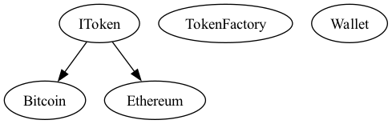
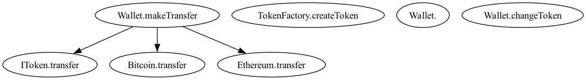
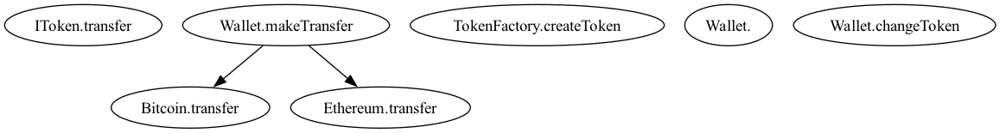
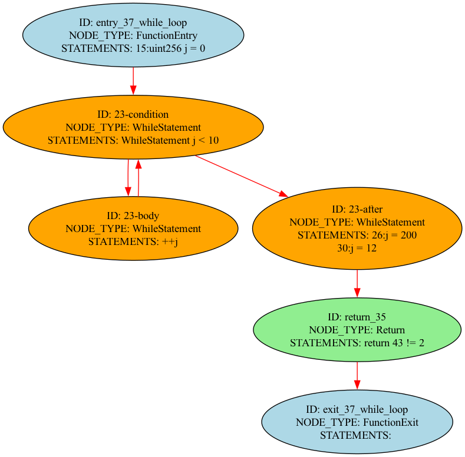

# Solidity Static Code Analyzer

# TODOs

- [x] Solidity AST Parser
- [x] Class Hierachy Analysis (CHA)
- [x] Call Graph using Class Hierachy Analysis (CHA)
- [x] Call Graph using Rapid Type Analysis (RTA)
- [ ] Call Graph using Hybrid Type Analysis (XTA)
- [ ] Call Graph using Variable Type Analysis (VTA)
- [x] Control Flow Analysis
- [x] Data Flow Analysis
- [ ] Taint Analysis
- [ ] Symbolic Execution
- [ ] ...many more

## Prerequisites

- solc 0.8.24
- graphviz 0.20.1

## Compiling Solidity Contracts

Use the following command to compile Solidity contracts and generate the required artifacts:

```bash
solc -o output --bin --ast-compact-json --asm contracts/example.sol
```

#### CHA

{}

#### Call Graph CHA

{}

#### Call Graph RTA

{}

#### Control Flow Analysis

{}
